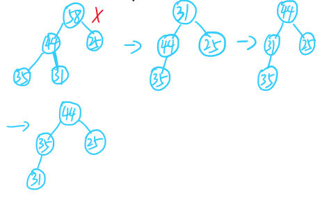

# DataStructure

* [DataStructure](#datastructure)
  * [知识网络](#%E7%9F%A5%E8%AF%86%E7%BD%91%E7%BB%9C)
    * [复杂度渐进表示法](#%E5%A4%8D%E6%9D%82%E5%BA%A6%E6%B8%90%E8%BF%9B%E8%A1%A8%E7%A4%BA%E6%B3%95)
    * [复杂度分析技巧](#%E5%A4%8D%E6%9D%82%E5%BA%A6%E5%88%86%E6%9E%90%E6%8A%80%E5%B7%A7)
    * [应用实例：最大子列和问题](#%E5%BA%94%E7%94%A8%E5%AE%9E%E4%BE%8B%E6%9C%80%E5%A4%A7%E5%AD%90%E5%88%97%E5%92%8C%E9%97%AE%E9%A2%98)
  * [线性表](#%E7%BA%BF%E6%80%A7%E8%A1%A8)
    * [多项式的表示](#%E5%A4%9A%E9%A1%B9%E5%BC%8F%E7%9A%84%E8%A1%A8%E7%A4%BA)
    * [线性表的ADT描述](#%E7%BA%BF%E6%80%A7%E8%A1%A8%E7%9A%84adt%E6%8F%8F%E8%BF%B0)
      * [顺序存储实现](#%E9%A1%BA%E5%BA%8F%E5%AD%98%E5%82%A8%E5%AE%9E%E7%8E%B0)
      * [链式存储实现](#%E9%93%BE%E5%BC%8F%E5%AD%98%E5%82%A8%E5%AE%9E%E7%8E%B0)
    * [二元多项式的表示](#%E4%BA%8C%E5%85%83%E5%A4%9A%E9%A1%B9%E5%BC%8F%E7%9A%84%E8%A1%A8%E7%A4%BA)
    * [十字链表表示稀疏矩阵](#%E5%8D%81%E5%AD%97%E9%93%BE%E8%A1%A8%E8%A1%A8%E7%A4%BA%E7%A8%80%E7%96%8F%E7%9F%A9%E9%98%B5)
  * [栈](#%E6%A0%88)
      * [栈的ADT描述](#%E6%A0%88%E7%9A%84adt%E6%8F%8F%E8%BF%B0)
        * [顺序存储实现](#%E9%A1%BA%E5%BA%8F%E5%AD%98%E5%82%A8%E5%AE%9E%E7%8E%B0-1)
        * [链式存储实现](#%E9%93%BE%E5%BC%8F%E5%AD%98%E5%82%A8%E5%AE%9E%E7%8E%B0-1)
      * [应用实例：中缀表达式求值](#%E5%BA%94%E7%94%A8%E5%AE%9E%E4%BE%8B%E4%B8%AD%E7%BC%80%E8%A1%A8%E8%BE%BE%E5%BC%8F%E6%B1%82%E5%80%BC)
  * [队列](#%E9%98%9F%E5%88%97)
      * [队列的ADT描述](#%E9%98%9F%E5%88%97%E7%9A%84adt%E6%8F%8F%E8%BF%B0)

## 知识网络


<div style="page-break-after: always;"></div>
## 基本概念


### 复杂度渐进表示法


*T(n) = n! 的算法不可用*

### 复杂度分析技巧


### 应用实例：最大子列和问题

给定n个整数的序列, 求函数的最大值。

**法一**

遍历法，找出所有子列的和，求最大值


```c++
int MaxSubSeqSum_1(vector<int> A) { // 遍历法，找出所有子列的和，求最大值
    int maxSum = 0, tempSum;
    for (int i = 0; i < A.size(); i++)
    {
        for (int j = i; j < A.size(); j++)
        {
            tempSum = 0;
            for (int k = i; k < j; k++)
            {
                tempSum += A[k];
            }
            if (tempSum > maxSum) maxSum = tempSum;
        }
    }
    return maxSum;
}
```
**法二**

优化法一，去掉*k*的循环

```c++
int MaxSubSeqSum_2(vector<int> A) { //遍历法改进，去掉k的循环
    int maxSum = 0, tempSum;
    for (int i = 0; i < A.size(); i++)
        {
            tempSum = 0;
            for (int j = i; j < A.size(); j++)
            {
                tempSum += A[j];
                if (tempSum > maxSum) maxSum = tempSum;
            }
        }
    return maxSum;
}
```

**法三**

分而治之（递归式）


```c++
int MaxSubSeqSum_3(vector<int> A) {  //分而治之，递归式
    return divideAndConquer(A, 0, A.size() - 1);
}

int divideAndConquer(vector<int>& A, int left, int right) {
    int maxLeftSum = 0, maxRightSum = 0, 
        maxLeftBorderSum = 0, maxRightBorderSum = 0, maxBorderSum = 0;
    int tempSumL = 0, tempSumR = 0; 
    if (left == right)  // 递归出口
    {
        if (A[left] > 0) return A[left];
        else return 0;
    }
    int center = (left + right) / 2;
    maxLeftSum = divideAndConquer(A, left, center); // 左区域子列和最大值
    maxRightSum = divideAndConquer(A, center + 1, right);  // 右区域子列和最大值
    for (int i = center; i >= left; i--)  // 由分界线向左扫描找最大值
    {
        tempSumL += A[i];
        if (tempSumL > maxLeftBorderSum) maxLeftBorderSum = tempSumL;
    }
    for (int i = center + 1; i <= right; i++)  // 由分界向右扫描找最大值
    {
        tempSumR += A[i];
        if (tempSumR > maxRightBorderSum) maxRightBorderSum = tempSumR;
    }
    maxBorderSum = maxLeftBorderSum + maxRightBorderSum;
    return maxLeftSum > maxRightSum ? (maxLeftSum > maxBorderSum ? maxLeftSum : maxBorderSum) 
        : (maxRightSum > maxBorderSum ? maxRightSum : maxBorderSum);
}
```

**法四**
在线处理：当前累加和小于0时就丢弃重新将tempSum归于0，继续累加。每次迭代都与当前的最大值比较。

```c++
int MaxSubSeqSum_4(vector<int> A) {  // 在线处理
    int tempSum = 0, maxSum = 0;
    for (int i = 0; i < A.size(); i++)
    {
        tempSum += A[i];
        if (tempSum > maxSum) maxSum = tempSum;
        else if (tempSum < 0) tempSum = 0;			
    }
    return maxSum;
}
```

## 线性表


### 多项式的表示

*表示多项式$f(x) = a_{0}x_{0} + a_{1}x_{1} + ... + a_{n}x_{n}$*

**顺序存储结构直接表示**
使用一维数组A[a~1~, a~2~, ... , a~n~], 其中a~i~表示x^i^的系数。

缺点：空间浪费，可能有很多0项。

**顺序存储结构表示非零项**

二元组(a~i~, i), a~i~表示系数， i是指数。

**链式结构存储非零项**

结点为：

```c++
struct Node {
    int coef;  //系数
    int expon; //指数
    struct Node* next;
}
```

### 线性表的ADT描述

线性表其实就是一个序列，可有序可无序，所谓“线性”主要指的是每个元素之间的关系是线性的。即第 *i* 个元素只与第 *i - 1* 和第 *i + 1* 个元素相关联。线性表可以采用数组存储，当然也可以使用链表存储。

#### 顺序存储实现

```c++
// 结点定义
const int MAXSIZE = 100;
typedef int ElementType;
typedef struct LNode* List;
class LNode {
public:
    ElementType data[MAXSIZE];
    int last;  // 指明线性表最后一个元素
};

List CreateStack() {
    List L;
    L = (List)malloc(sizeof(class LNode));
    L->last = -1;
    return L;
}

ElementType FindKth(int k, List L) {
    if (k < 0 || L->last < k)
    {
        printf("L->Data[%d]不存在元素", k);
    }
    return L->data[k];
}

int Find(ElementType x, List L) {
    int i = 0;
    for (i; (i <= L->last) && (L->data[i] != x); i++);
    if (i <= L->last) return i;
    else return -1;
}

void Insert(int i, ElementType x, List L) {
    if (L->last + 1 > MAXSIZE)
    {
        printf("表已满");
        return;
    }
    if (i < 1 || i > L->last + 2) 
    {
        printf("位置不合法");
        return;
    }
    for (int j = L->last; j >= i - 1; j--)
    {
        L->data[j + 1] = L->data[j];
    }
    L->data[i - 1] = x;
    L->last++;
    return;
} 

void Delete(int i, List L) {
    int j;
    if (i < 0 || i > L->last)
    {
        printf("位置不合法");
        return;
    }
    for (j = i; j <= L->last; j++)
    {
        L->data[j] = L->data[j + 1];
    }
    L->last--;
    return;
}

int Length(List L) {
    return L->last + 1;
}
```

#### 链式存储实现

```c++
// 结点定义
typedef int ElementType;
typedef struct LNode* List;
struct LNode {
    ElementType data;
    List next;
};

List CreateStack() {
    List L = (List)malloc(sizeof(struct LNode));
    L->next = NULL;
    return L;
}

int Length(List L) {
    int len = 0;
    List p = L;
    while (p)
    {
        p = p->next;
        len++;
    }
    return len;
};

List KthFind(int k, List L) {
    List p = L;
    int i = 1;
    while (p && i < k)
    {
        p = p->next;
        i++;
    }
    if (i == k)
    {
        return p;
    }
    else return NULL;
}

//List Find(ElementType x, List L) {
//	List p = L;
//	while (p)
//	{
//		if (p->data != x)
//		{
//			p = p->next;
//		}
//		else return p;
//			
//	}
//	return p;
//};

List Find(ElementType x, List L) {
    List p = L;
    while (p && p->data != x) p = p->next;
    return p;
}

List Insert(int i, ElementType x, List L) {
    List p, s;  //s指向新插入的节点, p指向第i-1个节点
    if (i == 1)
    {
        s = (List)malloc(sizeof(struct LNode));
        s->data = x;
        s->next = L;
        return s;
    }
    p = KthFind(i - 1, L);
    if (!p)
    {
        printf("序号错误");
        return NULL;
    }
    else
    {
        s = (List)malloc(sizeof(struct LNode));
        s->data = x;
        s->next = p->next;
        p->next = s;
        return L;
    }
};

List Delete(int i, List L) {
    List p, s;
    if (i == 1)
    {
        s = L;
        if (L)
        {
            L = L->next;
            free(s);
            return L;
        }
        else return NULL;
    }
    p = KthFind(i - 1, L);
    if (!p)
    {
        printf("结点错误");
        return NULL;
    }
    else
    {
        s = p->next; // s指向第i个结点
        p->next = s->next;
        free(s);
        return L;
    }
};
```

### 二元多项式的表示

*$p(x, y) = (9y^2 + 4)x^{12} + (15y^3 - y)x^8 + 3x^2$*


### 十字链表表示稀疏矩阵

**结点定义**


**链表示意**


## 栈

#### 栈的ADT描述

栈本质就是加了一定限制的线性表，这个限制即只允许在一端插入或删除元素。

##### 顺序存储实现

一维数组 + 记录栈顶元素位置的变量

```c++
typedef struct SNode* Stack;
typedef int ElementType;
const int maxsize = 100;

struct SNode {
    ElementType data[maxsize];
    int top; // top用于记录栈顶元素的位置
};

Stack CreateStack() {
    Stack s = (Stack)malloc(sizeof(struct SNode));
    s->top = -1;
    return s;
}

int IsEmpty(Stack s) {
    if (s->top == -1) return 1;
    else return 0;
}

int IsFull(Stack s) {
    if (s->top == maxsize - 1) return 1;
    else return 0;
}

void Push(ElementType x, Stack s) {
    if (s->top == maxsize)
    {
        printf("栈已满");
        return;
    }
    else
    {
        s->data[++(s->top)] = x;
        return;
    }
}

ElementType Pop(Stack s) {
    if (s->top == -1)
    {
        printf("栈空");
        return -1;
    }
    else
    {
        return s->data[(s->top)--];
    }
}
```

**用一个数组实现两个栈**


##### 链式存储实现

单向链表，在头节点一侧进行插入、删除结点操作（单向链表无法向前寻址）

```c++
typedef int ElementType;
typedef struct SNode* Stack;

struct SNode {
    ElementType data;
    Stack next;
};

Stack CreateStack() {
    Stack s = (Stack)malloc(sizeof(struct SNode));
    s->next = NULL;
    return s;
}

int IsEmpty(Stack s) {
    return (s->next == NULL);
}

void Push(Stack s, ElementType x) {
    Stack temp = (Stack)malloc(sizeof(struct SNode));
    temp->data = x;
    temp->next = s->next;
    s->next = temp;
}

ElementType Pop(Stack s) {
    if (IsEmpty(s))
    {
        printf("堆栈为空");
        return NULL;
    }
    else 
    {
        Stack firstNode = s->next;
        s->next = firstNode->next;
        ElementType top = firstNode->data;
        free(firstNode);
        return top;
    }
}

```

#### 应用实例：中缀表达式求值

*中缀表达式*：$ 2 + 9 / 3 - 5$

*后缀表达式*:  $293 / + 5 -$

step 1. 将中缀表达式转换为后缀表达式


**summary**：如何将中缀表达式转化为后缀表达式


step 2. 利用栈求解后缀表达式


## 队列

### 队列的ADT描述

队列是加了另一种限制的线性表，只允许在一端插入，另一端删除。

#### 顺序存储实现

**图示说明：**

利用数组 + 两个分别指示首、尾元素位置的指针变量实现队列，front指向首元素下标的前一个位置，rear指向末元素。如图：


为避免空间浪费，可以通过重置front、rear指针来实现所谓“循环队列”


初始时，front == rear，队列为空，而在上图的循环队列中队满时，front == rear也成立。这是因为大小为n的数组，装载元素的情况共有n + 1种，而front 和 rear差距共有n种，则肯定不能表示n + 1种元素装载情况。解决办法有两种：

（1）只使用n - 1个位置，简单粗暴；

（2）添加额外的标记如size、tag等。通过size记录队列的元素数量来区分front == rear时，队列是满还是空；tag可通过赋值为0或1来表示上一次队列操作是入队还是出队。如果tag == 1表示上一次操作为入队，而上一步操作过后发现front == rear了，则此时肯定是队列已满，而不是队列为空。

​              

**代码实现：**

```c++
#include<stdio.h>
#include<malloc.h>
typedef int ElementType;
typedef struct QNode* Queue;
const int maxsize = 3;

struct QNode {
    ElementType data[maxsize];
    int front, rear;
};

//方法声明
Queue CreateStack();
int IsEmpty(Queue q);
int IsFull(Queue q);
void Push(Queue q, ElementType x);
ElementType Pop(Queue q);

//方法定义
Queue CreateQueue() {
    Queue q = (Queue)malloc(sizeof(struct QNode));
    q->front = 0;
    q->rear = 0;
    return q;
}

int IsFull(Queue q) {
    return ((q->rear + 1) % maxsize == q->front);
}

int IsEmpty(Queue q) {
    return (q->front == q->rear);
}

void Push(Queue q, ElementType x) {
    if (IsFull(q))
    {
        printf("队列已满");
        return;
    }
    else
    {
        q->rear = (q->rear + 1) % maxsize;
        q->data[q->rear] = x;
    }
}

ElementType Pop(Queue q) {
    if (IsEmpty(q))
    {
        printf("队列空");
        return NULL;
    }
    else
    {
        q->front = (q->front + 1) % maxsize;
        return q->data[q->front];
    }
}
```


#### 链式存储实现

```c++
#include<stdio.h>
#include<malloc.h>
typedef int ElementType;
typedef struct QNode* Queue;

struct Node {
    ElementType data;
    struct Node* next;
};

struct QNode {
    struct Node* front;
    struct Node* rear;
};

Queue CreateQueue() {
    Queue q = (Queue)malloc(sizeof(struct QNode));
    q->front = NULL;
    q->rear = NULL;
    return q;
}

int IsEmpty(Queue q) {
    return (q->rear == NULL);
}

void Push(Queue q, ElementType x) {
    struct Node* temp = (struct Node*)malloc(sizeof(struct Node));
    temp->data = x;
    temp->next = NULL;
    if (IsEmpty(q))
    {
        q->front = temp;
        q->rear = temp;
    }
    else
    {
        q->rear->next = temp;
        q->rear = temp;
    }
}

ElementType Pop(Queue q) {
    ElementType frontElem;
    struct Node* frontNode;
    if (IsEmpty(q))
    {
        printf("¶Ó¿Õ");
        return NULL;
    }
    frontNode = q->front;
    if (q->front == q->rear)  //队列中只有一个元素
    {
        q->front = NULL;
        q->rear = NULL;
    }
    else
    {
        q->front = q->front->next;
    }
    frontElem = frontNode->data;
    free(frontNode);
    return frontElem;
} 
```

## 树


### 普通树的表示方法

**儿子兄弟表示法**

一颗普通树如图所示，采用儿子—兄弟表示法，结点设计为：
将普通树转化为二叉树：


### 二叉树

#### 五种基本形态


#### 特殊二叉树

（1）斜二叉树：所有结点都只有左儿子或右儿子


（2）完美二叉树（满二叉树）：除最后一层叶结点外，每个结点都有两个子结点


（3）完全二叉树：有 n 个结点的二叉树，对树中结点按从上至下、从左到右顺序进行编号，编号为 i（1 ≤ i ≤ n）结点与满二叉树中编号为 i 的结点在二叉树中位置相同


#### 性质

（1）第 *i* 层的最大结点数为2^i-1^ (i >= 1)；

（2）深度为k的二叉树的最大总结点数为2^k^-1 (k >= 1)；

（3）n~0~ = n~2~ + 1; (由总边数得：n~0~ + n~1~ + n~2~ - 1 = 0 * n~0~ + 1 * n~1~ + 2 * n~3~)；

#### ADT描述

**数据集：**有穷结点集合；

**操作集：**初始化、插入结点、遍历；

##### 顺序存储

（1）顺序存储完全二叉树

将二叉树的每个结点从根结点开始按层编号，根结点的序号为1。


对于非根结点的结点（序号 *i*  > 1），其父节点的下标为$\lfloor i / 2\rfloor$, 其左儿子的下标为$2i$，其右儿子下标为$2i + 1$.上面这棵树在数组中的存放结果为：


(2) 一般的二叉树：补充为完全二叉树进行存储（空间浪费！）

##### 链式存储

*对于空队、空栈，调用front等方法时会报错*

链式存储时的结点设计、初始化树、插入结点：

```c++
#include<stdio.h>
#include<malloc.h>
#include<stack>
#include<vector>
#include<queue>
using std::stack;
using std::vector;
using std::queue;

typedef int ElementType;
typedef struct TreeNode* BinTree;

struct TreeNode {
	ElementType data;
	BinTree left;
	BinTree right;
};

BinTree InitializeTree(ElementType x) {
	BinTree BT = (BinTree)malloc(sizeof(struct TreeNode));
	BT->data = x;
	BT->left = NULL;
	BT->right = NULL;
	return BT;
}

BinTree InsertLeft(BinTree BT, ElementType x)
{
	BT->left = InitializeTree(x);
	//BT->left->data = x;
	return BT->left;
}

BinTree InsertRight(BinTree BT, ElementType x)
{
	BT->right = InitializeTree(x);
	//BT->right->data = x;
	return BT->right;
}

BinTree Insert( ElementType x) {
	BinTree node = (BinTree)malloc(sizeof(struct TreeNode));
	node->data = x;
	node->left = NULL;
	node->right = NULL;
	return node;
}
```

###### 二叉树的遍历

*先序遍历*： 根-左-右；

*中序遍历*： 左-根-右；

*后序遍历*：左-右-根；

上述三种遍历可通过递归和迭代两种方式实现，递归式简单，迭代式借助栈实现。

三种遍历的递归式为：

```c++
// 二叉树的遍历(递归式)
// 先序遍历：根-左-右
void PreOrderTraversal(BinTree BT) {
	if (BT)
	{
		printf("%d", BT->data);
		PreOrderTraversal(BT->left);
		PreOrderTraversal(BT->right);
	}
}

//中序遍历：左-根-右
void InOrderTraversal(BinTree BT) {
	if (BT)
	{
		InOrderTraversal(BT->left);
		printf("%d", BT->data);
		InOrderTraversal(BT->right);
	}
}

//后序遍历：左-右-根
void PostOrderTraversal(BinTree BT) {
	if (BT)
	{
		PostOrderTraversal(BT->left);
		PostOrderTraversal(BT->right);
		printf("%d", BT->data);
	}
}
```

先序遍历、中序遍历的迭代式算法较为简单。以中序遍历为例，迭代式中序遍历的算法过程为：

（1）遇到一个结点就先入栈，遍历该结点的左子树；

（2）左子树遍历完后，弹出并访问该结点；

（3）遍历该结点的右子树；

（4）重复上述过程直到栈为空；

```c++
// 二叉树遍历（迭代式）
// 先序遍历
vector<ElementType> PreOrderTraversal_iteration(BinTree BT) {
	stack<BinTree> st;
	vector<ElementType> res;
	BinTree t = BT;
	while (t || !st.empty())
	{
		while (t)
		{
			res.push_back(t->data);
			st.push(t);
			t = t->left;
		}
		if (!st.empty())
		{
			t = st.top();
			st.pop();
			t = t->right;
		}
	}
	return res;
}

// 中序遍历
vector<ElementType> InOrderTraversal_iteration(BinTree BT)
{
	vector<ElementType> res;
	stack<BinTree> st;
	BinTree t = BT;
	while (t || !st.empty())
	{
		while (t)
		{
			st.push(t);
			t = t->left;
		}
		if (!st.empty())
		{
			t = st.top();
			st.pop();
			res.push_back(t->data);
			t = t->right;
		}
	}
	return res;
}
```

后序遍历较为复杂，因为要在第三次遇到结点时才访问，算法过程如下：

```c++
//后序遍历
vector<ElementType> PostOrderTraversal_iteration(BinTree BT)
{
	vector<ElementType> res;
	stack<BinTree> st;
	BinTree cur = BT;  // 指向当前处理的结点
	BinTree last = NULL; // 指向上一个被完整后序遍历过的树的根结点

	while (cur || !st.empty())
	{
		while (cur)
		{
			st.push(cur);
			cur = cur->left;
		}
		BinTree top = st.top();
		if (top->right == NULL)
		{
			res.push_back(top->data);
			st.pop();
			last = top;
		}
		else if (top->right == last)
		{
			res.push_back(top->data);
			st.pop();
			last = top;
		}
		else
		{
			cur = top->right;
		}

	}
	return res;
}
```

由二叉树的先、中、后序遍历序列反求二叉树时，必须要有中序遍历的结果序列才可以。算法过程如下：

**由先序序列和中序序列确定二叉树**

（1）先序序列：*abcdefghij*

（2）中序序列：*cbedahgijf*


*层序遍历*：上-下，左-右

二叉树的层序遍历核心问题是二维结构的线性化，借助队列，算法过程如下图所示：


```c++
// 层序遍历，借助队列实现
vector<ElementType> LevelOrderTraversal_queue(BinTree BT) {
	vector<ElementType> res;
	BinTree cur;
	queue<BinTree> q;
	q.push(BT);
	while (!q.empty())
	{
		cur = q.front();
		res.push_back(cur->data);
		if (cur->left) q.push(cur->left);
		if (cur->right) q.push(cur->right);
		q.pop();
	}
	return res;
}

// 错误版本
//vector<ElementType> LevelOrderTraversal_queue(BinTree BT) {
//	vector<ElementType> res;
//	BinTree cur = BT;
//	queue<BinTree> q;
//	while (cur)  // 这里应以队列是否为空作为判断条件
//	{
//		res.push_back(cur->data);
//		if (cur->left) q.push(cur->left);
//		if (cur->right) q.push(cur->right);
//		cur = q.front();  //front方法访问空队时会报错
//		q.pop();
//	}
//	return res;
//}
```

打印所有叶子节点：在先序遍历访问结点时加一个判断该结点是否为叶子结点的判断即可。

```c++
void PrintAllLeaves(BinTree BT) {
	if (BT)
	{
		if (!BT->left && !BT->right)
			printf("%d", BT->data);
		PrintAllLeaves(BT->left);
		PrintAllLeaves(BT->right);
	}
}
```

求二叉树的高度

```c++
int HeightofTree(BinTree BT) {
	int HL, HR, H;
	if (BT) {
		HL = HeightofTree(BT->left);
		HR = HeightofTree(BT->right);
		H = (HL > HR ? HL : HR);
		return H + 1;
	}
	else return 0;
}
```

### 二叉搜索树

#### 定义

二叉搜索树（二叉排序树、二叉查找树）或者是一棵空树，或者是具有下列性质的二叉树： 若它的左子树不空，则左子树上所有结点的值均小于它的根结点的值； 若它的右子树不空，则右子树上所有结点的值均大于它的根结点的值； 它的左、右子树也分别为二叉排序树。

#### 二叉搜索树的特殊操作

查找特定元素、查找最小 \大值

```c++
typedef int ElementType;
typedef struct TreeNode* BinTree;

struct TreeNode {
	ElementType data;
	BinTree left;
	BinTree right;
};

BinTree Find(BinTree BST, ElementType x) {
	if (BST)
	{
		if (BST->data == x) return BST;
		else if (BST->data < x) Find(BST->right, x);
		else Find(BST->left, x);
	}
	else return NULL;
}

BinTree Find_iteration(BinTree BST, ElementType x) {
	if (!BST) return NULL;
	while (BST)
	{
		if (BST->data == x) return BST;
		else if (BST->data < x) BST = BST->right;
		else BST = BST->left;
	}
}

BinTree FindMin(BinTree BST) {
	if (!BST) return NULL; // 如果是空树
	else if (!BST->left) return BST;
	else return FindMin(BST->left);
}

BinTree FindMin_iteration(BinTree BST) {
	if (!BST) return NULL;
	while (BST) 
	{
		if (!BST->left) return BST;
		BST = BST->left;
	}
}

BinTree FindMax(BinTree BST) {
	if (!BST) return NULL;
	if (!BST->right) return BST;
	else FindMax(BST->right);
}
```

插入元素


```c++
BinTree Insert(BinTree BST, ElementType x) {
	if (!BST)
	{
		BST = (BinTree)malloc(sizeof(struct TreeNode));
		BST->data = x;
		BST->left = BST->right = NULL;
	}
	else if (BST->data > x)
	{
		BST->left = Insert(BST->left, x);
	}
	else BST->right = Insert(BST->right, x);
	return BST;
}
```

删除元素

（1）删除叶子结点——直接删

（2）删除一个孩子的结点


（3）删除两个孩子的结点


```c++
BinTree Delete(BinTree BST, ElementType x) {
	BinTree temp;
	if (!BST) printf("未找到要删除的元素");
	else if (BST->data < x)
	{
		BST->right = Delete(BST->right, x);
	}
	else if (BST->data > x)
	{
		BST->left = Delete(BST->left, x);
	}
	else   //找到了要删除的元素
	{
		if (BST->left && BST->right)  //如果两个孩子都存在
		{
			temp = FindMin(BST->right);
			BST->data = temp->data;
			BST->right = Delete(BST->right, temp->data);
		}
		else  // 如果只有一个孩子或无孩子
		{
			temp = BST;
			if (!BST->left) BST = BST->right;
			else if (!BST->right) BST = BST->left;
			free(temp);
		}
	}
		return BST;
}
```

#### 平衡二叉树（AVL树）

*为什么使用平衡二叉树？*

二叉搜索树的搜索效率与其树的深度相关，而二叉搜索树的组成又与其插入序列相关，在极端情况下，二叉搜索树退化为一条单链（比如插入序列是 1 2 3 … n），使得搜索效率大大降低，为了避免这种情况出现，我们采用二叉平衡树对插入结点进行调整，使得树的深度尽可能小

*定义*


*调整方法*

1. RR 单旋

当"插入结点"(BR)是"被破坏平衡结点"(A)的**右子树**的**右子树**时，即 RR 插入时，采用 RR 旋转调整

 

 其基本思路是把 B 的左子树腾出来挂到 A 的右子树上，返回 B 作为当前子树的根

示意图：


```c++
AVLTree RRRotation(AVLTree A){
	AVLTree B = A->right;   // B 为 A 的右子树  
	A->right = B->left;    // B 的左子树挂在 A 的右子树上 
	B->left = A;   //  A 挂在 B 的左子树上 
	return B;  // 此时 B 为根结点了   
}
```

2. LL 单旋

当"插入结点"(BL)是"被破坏平衡结点"(A)**左子树**的**左子树**时，即 LL 插入，采用 RR 旋转调整
 
 其基本思路是把 B 的右子树腾出来挂到 A 的左子树上，返回 B 作为当前子树的根

示意图：
 

```c++
AVLTree LLRotation(AVLTree A){
	// 此时根节点是 A 
	AVLTree B = A->left;  // B 为 A 的左子树  
	A->left = B->right;   // B 的右子树挂在 A 的左子树上 
	B->right = A;     //  A 挂在 B 的右子树上 
	return B;  // 此时 B 为根结点了 
}
```

3. LR 双旋

当"插入结点"(CL 或者 CR)是"被破坏平衡结点"(A)**左子树**的**右子树**时，即 LR 插入，采用 LR 旋转调整
 
 基本思想是先将 B 作为根结点进行 **RR 单旋**转化为 LL 插入，再将 A 作为根结点进行 **LL 单旋**（先 RR 再 LL）

示意图：
 

```c++
AVLTree LRRotation(AVLTree A){
	// 先 RR 单旋
	A->left = RRRotation(A->left);
	// 再 LL 单旋 
	return LLRotation(A);
}
```

总结：叫 LR 双旋是从上到下看，而实际先 RR 单旋再 LL 单旋是从下往上的过程

4. RL 双旋

当"插入结点"(CL 或者 CR)是"被破坏平衡结点"(A)**右子树**的**左子树**时，即 RL 插入，采用 RL 旋转调整
 
 基本思想是先将 B 作为根结点进行 **LL 单旋**转化为 RR 插入，再将 A 作为根结点进行 **RR单旋**（先 LL 再 RR）

示意图：
 

```c++
AVLTree RLRotation(AVLTree A){
	// 先 LL 单旋
	A->right = LLRotation(A->right);
	// 再 RR 单旋 
	return RRRotation(A); 
}
```

总结：叫 RL 双旋是从上到下看，而实际先 LL 单旋再 RR 单旋是从下往上的过程

### 堆

#### 最大堆的建立

两种方式：

（1）将元素一个个相继插入到一个初始化为空的堆中；

（2）以线性复杂度建立最大堆：1.将元素按输入顺序存入数组——满足结构性；

​														2.调整元素顺序——满足有序性。

*调整元素顺序：*从最后一个有儿子的结点开始，依次像前调整。


#### 堆的ADT描述

*采用将元素插入到空堆的方式建立最大堆：*

初始化、判空、判满

```c++
typedef int ElementType;
typedef struct Heap* MaxHeap;

const int MaxData = 10000;
const int ERROR = -1;;

struct Heap {
	ElementType* Elements;  //存储堆元素的数组
	int size; //当前元素的个数
	int capacity; //堆的容量
};

MaxHeap createHeap(int maxsize) {  // 建立一个空堆
	MaxHeap H = (MaxHeap)malloc(sizeof(struct Heap));
    // (maxsize + 1): 多申请一块内存用于放置哨兵结点
	H->Elements = (ElementType*)malloc((maxsize + 1) * sizeof(ElementType));
	H->size = 0;
	H->capacity = maxsize;
    // MaxfData大于堆中所有可能的元素，是一个哨兵结点。
	H->Elements[0] = MaxData;
	return H;
}

bool isFull(MaxHeap H) {
	return (H->size == H->capacity);
}

bool isEmpty(MaxHeap H) {
	return !H->size;
}
```

插入元素（最大堆的插入）：

注意堆是完全二叉树，因此下一个元素的位置一定是处于6号位置。为了满足最大堆的有序性，在插入操作的函数中还要包括调整元素顺序的部分。


```c++
void insert(MaxHeap H, ElementType x) {
	if (isFull(H))
	{
		printf("堆已满");
		return;
	}
	int i = ++H->size;
	for (; H->Elements[i / 2] < x; i /= 2)
	{
		H->Elements[i] = H->Elements[i / 2];  //比交换数据要快
	}
	H->Elements[i] = x;
}
```

删除\弹出堆的最大值：

最大堆的中最大值一定是位于1号位置，删除最大值后，将最后一个位置的元素置于1号位置，而后再次调整元素顺序满足有序性。



```c++
ElementType deleteMax(MaxHeap H) {  // 返回并删除H中的最大值
	if (isEmpty(H))
	{
		printf("堆空");
		return NULL;
	}
	int parent, child;
	ElementType max = H->Elements[1];
	ElementType temp = H->Elements[H->size--];
	for (parent = 1; parent * 2<=H->size; parent=child)
	{
		child = parent * 2;
		if ((child != H->size) &&
			(H->Elements[child] < H->Elements[child + 1]))
			child++;
		if (temp >= H->Elements[child]) break;
		else
			H->Elements[parent] = H->Elements[child];
	}
	H->Elements[parent] = temp;
	return max;
}
```

### 哈夫曼树

*为什么使用哈夫曼树？*

不同结点的查找频率是不同的，使用哈夫曼树可以根据结点的不同查找频率构造更有效的搜索树。

#### 定义

**带权路径长度（WPL)：**设二叉树有n个叶子结点，每个叶子结点带有权值 $w_k$，从根结点到每个叶子结点的长度为$l_k$，则每个叶子结点的带权路径长度之和就是：$WPL=\sum_{k=1}^{n}w_kl_k$
**最优二叉树或哈夫曼树：**WPL 最小的二叉树

#### 构造


```c++
typedef struct TreeNode* huffmanNode;
typedef struct Heap* minHeap;

vector<int> A = {1, 3, 5, 8};
const int minData = -1000;

struct TreeNode {
	int weight;
	huffmanNode left;
	huffmanNode right;
};

struct Heap {
	int size;
	int capacity;
	huffmanNode* elements;
};

huffmanNode initHuffNode() {
	huffmanNode Huff = (huffmanNode)malloc(sizeof(struct TreeNode));
	Huff->weight = 0;
	Huff->left = NULL;
	Huff->right = NULL;
	return Huff;
}

minHeap initMinHeap(int maxsize) {
	minHeap H = (minHeap)malloc(sizeof(struct Heap));
	H->size = 0;
	H->capacity = maxsize;
	H->elements = (huffmanNode*)malloc(sizeof(struct TreeNode) * (maxsize + 1));
	huffmanNode huff;
	huff = initHuffNode();
	huff->weight = minData;
	H->elements[0] = huff;
	return H;
}

void sort(minHeap H) {
	for (int i = H->size / 2; i > 0; i--)
	{
		int parent, child;
		int temp = H->elements[i]->weight;
		for (parent = i; parent * 2 <= H->size; parent = child)
		{
			child = parent * 2;
			if ((child != H->size) && (H->elements[child] > H->elements[child + 1]))
			{
				child++;
			}
			if (H->elements[child]->weight >= temp)
				break;
			else
				H->elements[parent] = H->elements[child];
		}
		H->elements[parent]->weight = temp;
	}
}

void buildMinHeap(minHeap H) {  //建立最小堆，将预设的权值存入堆中
	huffmanNode huff;

	for (int i = 0; i < A.size(); i++)
	{
		huff = initHuffNode();
		huff->weight = A[i];
		H->elements[++H->size] = huff;
	}
	sort(H);
}

huffmanNode Delete(minHeap H) {
	int parent, child;
	huffmanNode T = H->elements[1];
	huffmanNode temp = H->elements[H->size--];
	for (parent = 1; parent * 2 <= H->size; parent = child)
	{
		child = parent * 2;
		if ((child != H->size) &&
			(H->elements[child]->weight > H->elements[child + 1]->weight))
			child++;
		if (H->elements[child]->weight >= temp->weight)
			break;
		else
			H->elements[parent] = H->elements[child];
	}
	H->elements[parent] = temp;
	return T;
}

void Insert(minHeap H, huffmanNode huff) {
	int weight = huff->weight;
	int i = ++H->size;
	for (; weight < H->elements[i / 2]->weight; i /= 2)
		H->elements[i] = H->elements[i / 2];
	H->elements[i] = huff;
}
 
huffmanNode huffmanTree(minHeap H) {
	huffmanNode T;
	buildMinHeap(H);
	int times = H->size;
	for (int i = 1; i < times; i++)
	{
		T = (huffmanNode)malloc(sizeof(struct TreeNode));
		T->left = Delete(H);
		T->right = Delete(H);
		T->weight = T->left->weight + T->right->weight;
		Insert(H, T);
	}
	T = Delete(H);
	return T;
}
```

####  哈夫曼树的特点

- 没有度为 1 的结点

- n 个叶结点的哈夫曼树共有 2n-1 个结点

- 哈夫曼树的任意非叶结点的左右子树交换后仍是哈夫曼树

- 对同一组权值，可能存在不同构的多棵哈夫曼树

#### 哈夫曼编码

- 左0右1
- 元素只出现在叶结点


## 图


