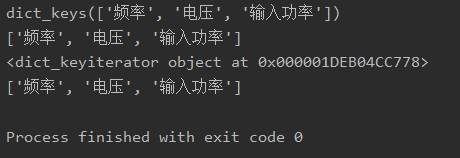

# Personal HandBook(c++)

## Common
### 调用类（实例化类）的两种方式

```c++
class example {
    void test () {
		...
    }
}

void main () {
    //  实例化一个对象
    example obj;
    obj.test();
    // 定义一个指针
    example* pointer = new example();
    pointer->test();
}
```

### INT_MIN、INT_MAX

INT_MIN在标准头文件limits.h中定义

#define INT_MAX 2147483647

#define INT_MIN (-INT_MAX - 1)

## string 

- s.find()  返回值是字母在母串中的位置（下标记录），如果没有找到，那么会返回一个特别的标记npos。（返回值可以看成是一个int型的数）

```c++
int pos = s.find("abf");
if (pos != s.npos)
    ...
```

- s.replace()

```c++
s.replace(pos, len, "b"); // 用"b"替换pos处为起点,长度len的范围内的字符.
```

- 字符串的拼接

在 C++ 中，res += s 和 res = res + s 的含义是不一样的。前者是直接在 res 后面添加字符串；后者是用一个临时对象计算 res + s，会消耗很多时间和内存。

## vector

- 插入元素：insert(a, b)，其中a是迭代器，b是要插入的元素；
- 反转链表：reverse(a, b)，a、b为迭代器，指示要反转的元素范围；
- 清空元素：clear(),清空元素，但不回收空间；
- 删除元素：erase()，有两种形式——
    - 1.iterator erase(iterator position);  //删除当前位置的元素。
    - 2.iterator erase(iterator first, iterator last);  //删除当前区间的元素。
- 初始化指定大小的vector：
  - 一维：`vector<int> vec(n)`或`vector<int> vec(n, 0)`
  - 二维：`vecotr<vector<int>> vec(n, vector<int>(m))` 或`vecotr<vector<int>> vec(n, vector<int>(m, 0))` 

## 栈

- 对空栈使用pop()、top()等方法会报错。==因此循环中做此操作前要先检查栈是否为空。==

## 堆（优先队列）

- c++中使用优先队列：

```c++
#include<queue>
#include<vector>
using namespace std;

// maxheap(default)
priority_queue<int> q_max;
//is equal to↓↓↓
priority_queue<int, vector<int>, less<int> > q_max;

// minheap
priority_queue<int, vector<int>, greater<int> > q_min;
```
- 自定义类型(如: ListNode)的比较函数

```python
struct cmp{
    bool operator ()(const ListNode* l1, const ListNode* l2){
        return l1->val < l2->val;//小的放左边,即升序
    }
};
struct cmp{
    bool operator ()(const ListNode* l1, const ListNode* l2){
        return l1->val > l2->val;//大的放左边,即降序
    }
};
int main(){
    priority_queue<int,vector<int>,cmp> pq;
}
```

- 基本操作：与普通队列基本一致。

> top 访问队头元素 
>
> empty 队列是否为空 
>
> size 返回队列内元素个数 
>
> push 插入元素到队尾 (并排序) 
>
> emplace 原地构造一个元素并插入队列 
>
> pop 弹出队头元素 
>
> swap 交换内容


## 哈希表

## sort

- 自定义sort的比较函数

```python
int main() {
    vector<string> vec
    auto cmp = [](string a, string b){return a < b};
    sort(vec.begin(), vec.end(), cmp);
}
```


## 力扣错误记录

>solution.cpp: In member function isMirror
>Line 24: Char 5: ==error: control reaches end of non-void function [-Werror=return-type]==
>     }
>     ^
>cc1plus: some warnings being treated as errors

**解决办法：**给函数最后添加一句“return”（虽然用不上）

# Personal HandBook(python)

## 批量初始化

```python
a, b, c, d = [0] * 4
```

注意，不能利用这种写法用于对象的赋值。

```python
from tkinter import*
a, b, c, d = [Entry()] * 4
// 此时的a、b、c、d其实指的是一个对象
```

##  列表

###  列表的赋值：深拷贝、浅拷贝

### 生成0 - n-1 的列表

```Python
list(range(n))
```


### 列表的常用操作

```Python
p = []
p[-1] # 列表中最后一个元素
```

## 哈希表

### 获取哈希表的键

Python中没有c++中的哈希表的pair类型,可以通过keys、iter等方法获取键值。不过其返回值是迭代器，需要list转一下。

```Python
text = {'频率': 'freq', '电压': 'vol', '输入功率': 'inputPower'}
print(text.keys())
print(list(text.keys()))
print(iter(text))
print(list(iter(text)))
```

结果如下：


